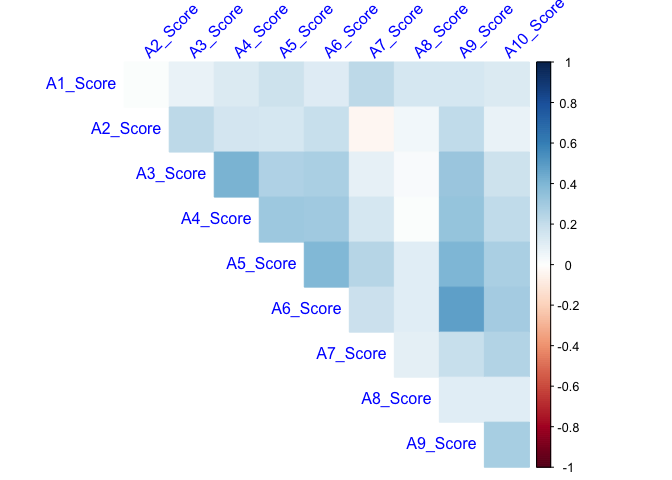
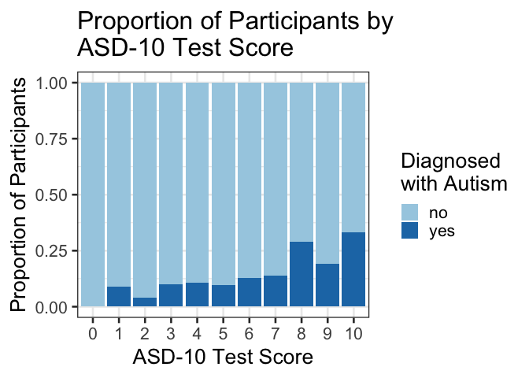

## Autism Screening

### Introduction

Autism Spectrum Disorder (ASD) is a complex neurodevelopmental condition that impairs social interpretation/communication ability, as well as the presence of repetitive behaviors.
Current diagnostic procedures are lengthy and inefficient [@Fadi]. 
Affecting 1.5% of the population, with many more cases going undetected, an easy-to-implement, effective screening method is warranted.
ASDTest, a mobile app, has been introduced to provide an accessible screening method that tells the user whether they should seek professional healthcare opinions, based on a 10 question survey [@allison2012toward].
The ability to recognize and diagnose ASD at an early age can allow the affected to access the healthcare resources and support they will need, in a timely manner. 

The Autism Spectrum Quotient-10 ([AQ-10](https://www.nice.org.uk/guidance/cg142/resources/autism-spectrum-quotient-aq10-test-pdf-186582493)) consists of 10 questions intended to differentiate characteristics of autism in individuals.
Each question has four possible answers: "Definitely Agree", "Slightly Agree, "Slightly Disagree", and "Definitely Disagree".
For questions 1, 5, 7, and 10, a value of 1 is assigned for either a "slightly agree" or a "definitely agree" response.
For questions 2, 3, 4, 6, 8, and 9, a value of 1 is assigned for either a "slightly disagree" or a "definitely. disagree" response.
A cumulative score is calculated and a participant who receives a total score of greater than 6 is recommended for a specialist diagnostic assessment.


### Data Description

The [dataset](https://archive.ics.uci.edu/ml/datasets/Autism+Screening+Adult)  used in this analysis was obtained from the University of California Irvine Machine learning Repository, uploaded by Fadi Thabtah.
Each row represents an individual who participated in the survey.
The survey's results, the app's classification, and some background information about the individual was recorded.
Below is the entire variable set:

<table class="table table-condensed" style="width: auto !important; margin-left: auto; margin-right: auto;">
 <thead>
  <tr>
   <th style="text-align:left;position: sticky; top:0; background-color: #FFFFFF;">  Variable           </th>
   <th style="text-align:left;position: sticky; top:0; background-color: #FFFFFF;">  Type              </th>
   <th style="text-align:left;position: sticky; top:0; background-color: #FFFFFF;">  Description                                                                                                                             </th>
  </tr>
 </thead>
<tbody>
  <tr>
   <td style="text-align:left;"> A1_score </td>
   <td style="text-align:left;"> Int (0,1) </td>
   <td style="text-align:left;"> Prompt (yes/no): I often notice small sounds when others do not </td>
  </tr>
  <tr>
   <td style="text-align:left;"> A2_score </td>
   <td style="text-align:left;"> Int (0,1) </td>
   <td style="text-align:left;"> Prompt (yes/no): I usually concentrate more on the whole picture, rather than the small details </td>
  </tr>
  <tr>
   <td style="text-align:left;"> A3_score </td>
   <td style="text-align:left;"> Int (0,1) </td>
   <td style="text-align:left;"> Prompt (yes/no): I find it easy to do more than one thing at once </td>
  </tr>
  <tr>
   <td style="text-align:left;"> A4_score </td>
   <td style="text-align:left;"> Int (0,1) </td>
   <td style="text-align:left;"> Prompt (yes/no): If there is an interruption, I can switch back to what I was doing very quickly </td>
  </tr>
  <tr>
   <td style="text-align:left;"> A5_score </td>
   <td style="text-align:left;"> Int (0,1) </td>
   <td style="text-align:left;"> Prompt (yes/no): I find it easy to 'read between the lines' when someone is talking to me </td>
  </tr>
  <tr>
   <td style="text-align:left;"> A6_score </td>
   <td style="text-align:left;"> Int (0,1) </td>
   <td style="text-align:left;"> Prompt (yes/no): I know how to tell if someone listening to me is getting bored </td>
  </tr>
  <tr>
   <td style="text-align:left;"> A7_score </td>
   <td style="text-align:left;"> Int (0,1) </td>
   <td style="text-align:left;"> Prompt (yes/no): When I'm reading a story I find it difficult to work out the characters' intentions </td>
  </tr>
  <tr>
   <td style="text-align:left;"> A8_score </td>
   <td style="text-align:left;"> Int (0,1) </td>
   <td style="text-align:left;"> Prompt (yes/no): I like to collect information about categories of things(e.g. types of car, types of bird, types of train, types of plant etc) </td>
  </tr>
  <tr>
   <td style="text-align:left;"> A9_score </td>
   <td style="text-align:left;"> Int (0,1) </td>
   <td style="text-align:left;"> Prompt (yes/no): I find it easy to work out what someone is thinking or feeling just by looking at their face </td>
  </tr>
  <tr>
   <td style="text-align:left;"> A10_score </td>
   <td style="text-align:left;"> Int (0,1) </td>
   <td style="text-align:left;"> Prompt (yes/no): I find it difficult to work out people's intentions </td>
  </tr>
  <tr>
   <td style="text-align:left;"> Age </td>
   <td style="text-align:left;"> Int </td>
   <td style="text-align:left;"> Age of the individual </td>
  </tr>
  <tr>
   <td style="text-align:left;"> Gender </td>
   <td style="text-align:left;"> String </td>
   <td style="text-align:left;"> M (male) or F (female) </td>
  </tr>
  <tr>
   <td style="text-align:left;"> Ethnicity </td>
   <td style="text-align:left;"> String </td>
   <td style="text-align:left;"> Common Ethnicities defined for each individual </td>
  </tr>
  <tr>
   <td style="text-align:left;"> Born with Jaundice? </td>
   <td style="text-align:left;"> String (yes,no) </td>
   <td style="text-align:left;"> Was individual born with jaundice? </td>
  </tr>
  <tr>
   <td style="text-align:left;"> Country of Residence </td>
   <td style="text-align:left;"> String </td>
   <td style="text-align:left;"> Home country of individual </td>
  </tr>
  <tr>
   <td style="text-align:left;"> Used app before? </td>
   <td style="text-align:left;"> String (yes, no) </td>
   <td style="text-align:left;"> Has the user has used a screening app </td>
  </tr>
  <tr>
   <td style="text-align:left;"> Result </td>
   <td style="text-align:left;"> Int </td>
   <td style="text-align:left;"> Cumulative score of the 10 survey Q's </td>
  </tr>
  <tr>
   <td style="text-align:left;"> age_desc </td>
   <td style="text-align:left;"> String </td>
   <td style="text-align:left;"> Age Group </td>
  </tr>
  <tr>
   <td style="text-align:left;"> relation </td>
   <td style="text-align:left;"> String </td>
   <td style="text-align:left;"> Parent, self, caregiver, medical staff, clinician ,etc. </td>
  </tr>
  <tr>
   <td style="text-align:left;"> ASD/Class </td>
   <td style="text-align:left;"> String (yes, no) </td>
   <td style="text-align:left;"> App's classification based on result </td>
  </tr>
  <tr>
   <td style="text-align:left;"> autism (Target Variable) </td>
   <td style="text-align:left;"> String (yes, no) </td>
   <td style="text-align:left;"> Does individual have an autism diagnosis? </td>
  </tr>
</tbody>
</table>

### Exploring the Dataset


```r
# First we read in the dataset.
# This dataset is in .arff format rather than the more standard .csv
# so we need to load a separate library ("foreign")
df <- foreign::read.arff("../data/Autism-Adult-Data.arff")
```

#### Correllogram

From the correllogram below, we can see that there's very little correlation among any of the ten 'question' variables in the dataset.
The colour scheme shows all positive correlations as blue, and all negative correlations as red.


```r
# Convert numeric columns to 'double' type
df[1:10] <- sapply(df[1:10], as.double)
autism_corr <- cor(df[1:10])

# Round the values to 2 decimal places
autism_corr <- round(autism_corr,2)
corrplot(autism_corr, 
         type="upper", 
         method="color",
         tl.srt=45, 
         tl.col = "blue",
         diag = FALSE)
```

<!-- -->

#### Dodged Bar Chart

The dodged bar chart below shows the occurences of autism in people of different ethnicities who took the survey.
This plot also illustrates an issue with the dataset: there are two levels called 'others' and one called NA.
We should definitely combine the two 'others' columns and also decide what to do about the NAs.


```r
df  %>% 
    ggplot(aes(x=ethnicity, fill=austim))+
    geom_bar(stat="count", position = "dodge")+
    labs(x = "Ethnicity", y = "Count", title = "Occurence of Autism by Ethnicity") + 
    scale_fill_discrete(name="Autism") + # This changes the legend title
    theme_bw(18) + # Change the theme and set the font size
    coord_flip() # Flip x- and y-axis
```

<!-- -->

#### Proportional Bar Chart

The proportional bar chart below shows the percentage of people who were diagnosed with autism given a particular score on the autism screening test.
A score of 0 would mean that it's incredibly unlikely the person would be diagnosed with autism.
In general, the higher the score, the more likely it is that the person has autism.


```r
df%>% 
    ggplot()+
    geom_bar(mapping = aes(x=as.factor(result), fill = austim),
             position = "fill")+
    ylab("Proportion of Participants")+
    xlab("ASD-10 Test Score")+
    ggtitle("Proportion of Participants by \nASD-10 Test Score")+
    scale_fill_brewer(name = "Diagnosed \nwith Autism", palette = "Paired") +
    theme_bw(20)
```

<!-- -->

### Research Question

In this analysis, we will seek to determine the relationship between the AQ-10 result (cumulative score) and the age of the individual.

### Plan of Action

With our research question, we are only interested in the cumulative score and the age of the individual taking the survey. 
We will ignore the other variables for the purposes of this analysis. 
After dealing with the missing data, we will perform a linear regression analysis and plot the relevant variables with a regression line. 

### References

Thomas Pin and Tejas Phaterpekar, Matthew Connell - Autism Spectrum Disorder Screening Machine Learning Analysis - https://github.com/UBC-MDS/522-Workflows-Group-414
